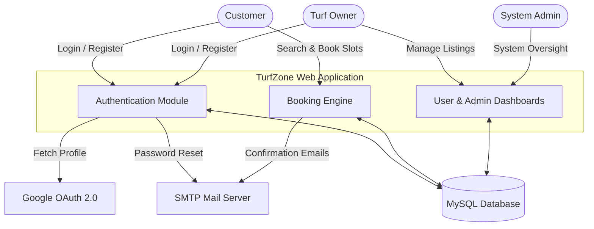

# TurfZone Booking and Management System

TurfZone is a comprehensive web-based platform designed to facilitate the booking and management of sports turfs. It serves as a bridge between turf owners and customers, providing a centralized system for listing venues, scheduling slots, and managing reservations.

## System Architecture

The following diagram illustrates the high-level interaction between the system's primary actors and the core components:

## Core Features

*   **Role-Based Access Control:** Distinct interfaces and privileges for Customers, Turf Owners, and Administrators.
*   **Customer Portal:** Allows users to browse available sports turfs, check real-time slot availability, make bookings, and view historical reservation data.
*   **Owner Dashboard:** Empowers facility owners to register their turfs, define operational hours, create bookable slots, and monitor customer reservations.
*   **Administrative Control:** Centralized dashboard for platform administrators to oversee user activity and turf listings.
*   **Authentication & Security:** 
    *   Standard email and password registration with secure hashing.
    *   Third-party Single Sign-On (SSO) integration via Google OAuth 2.0.
*   **Automated Notifications:** Integration with PHPMailer to dispatch transactional emails for account verification, password resets, and booking confirmations.

## Technology Stack

*   **Frontend:** HTML5, CSS3, Vanilla JavaScript
*   **Backend:** PHP
*   **Database:** MySQL
*   **External Libraries:** PHPMailer (Email), Google API Client (OAuth)

## Setup and Installation

### Prerequisites
A local web server environment capable of running PHP and MySQL is required (e.g., XAMPP, WAMP, or MAMP).

### Deployment Steps

1.  **Environment Preparation:** Start the Apache web server and MySQL database services via your local server control panel.
2.  **Project Placement:** Clone or extract this repository into your web server's root directory. For XAMPP environments, this is typically `C:\xampp\htdocs\turf`.
3.  **Database Initialization:**
    *   Navigate to your local database management tool (e.g., `http://localhost/phpmyadmin`).
    *   Create a new, empty database named `turf`.
    *   Import the provided database schema and initial data by executing the `turf (1).sql` file located in the project root.
4.  **Database Configuration:**
    *   Open `config.php` in a text editor.
    *   Ensure the database connection string matches your local environment credentials (default is `localhost`, user `root`, no password).

## Environment Configuration

Certain features require valid API credentials to function locally. These should be configured before testing the application.

### Email Configuration (PHPMailer)
Transactional emails require a valid SMTP configuration.
1.  Locate the PHPMailer initialization blocks within `register.php`, `owner_register.php`, and `forgot_password.php`.
2.  Replace the placeholder `YOUR_EMAIL@gmail.com` with a valid sender address.
3.  Replace `YOUR_APP_PASSWORD` with a secure App Password generated from your email provider (do not use your primary account password).

### Google Authentication
1.  Navigate to the Google Cloud Console and generate OAuth 2.0 credentials for a Web Application.
2.  Open `google-callback.php`.
3.  Replace `YOUR_GOOGLE_CLIENT_ID` and `YOUR_GOOGLE_CLIENT_SECRET` with the credentials obtained from the Google Cloud Console.

> **Note:** Ensure that sensitive credentials and API keys are never committed to public version control repositories. Use the provided `.gitignore` file to manage environment-specific configurations securely.
